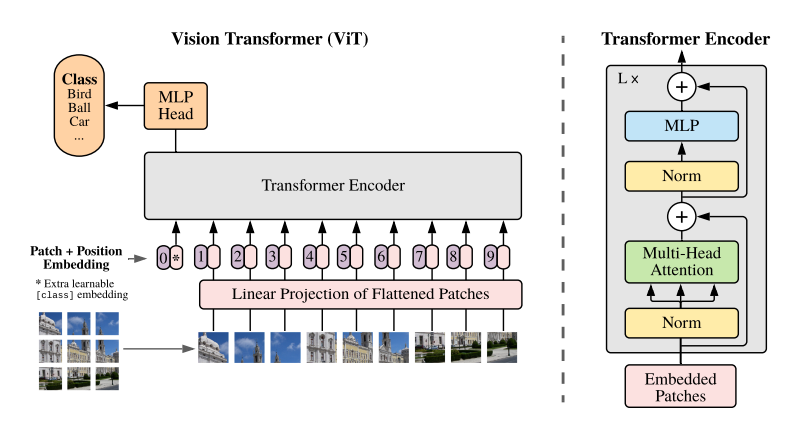
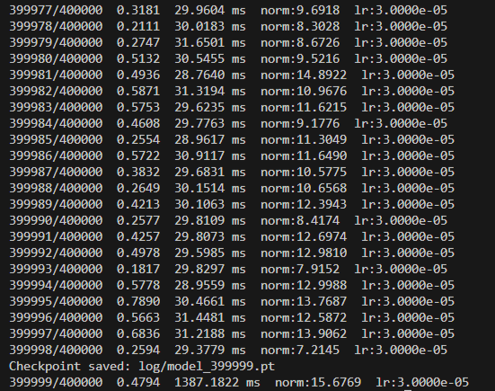
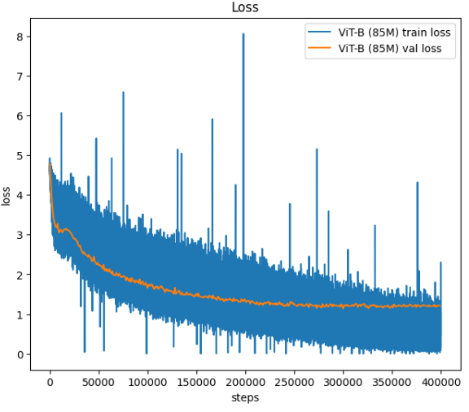

# Vision Transformer (ViT) Implementation from Scratch

## Overview
This repository contains an implementation of the paper  
**“An Image Is Worth 16×16 Words: Transformers for Image Recognition at Scale”**  
by *Dosovitskiy et al., 2021.*

Our goal is to reproduce and fine tune the Vision Transformer (ViT-B/16) architecture using **PyTorch**, complete with training, evaluation and visualization pipelines.

---

## ViT Architecture

<p align="center">
  
</p>

---

### Vision Transformer Model Configuration
```
ViT Base
n_layer    = 12
n_head     = 12
n_embd     = 768
mlp hidden = 4 * n_embd

Total parameters = ~86M
```


**Training Configuration**
```
Max Iterations = 400000
Batch Size     = 32  
Warmup Ratio   = 0.05     (LR Schedule: Warmup + Cosine Decay)
Max lr         = 3e-4     (Min lr = 3e-5)
Dropout        = 0.1
Weight Decay   = 0.1      (Optimizer AdamW)
Gradint Clip   = 1.0

[IMAGENET100 Dataset](https://huggingface.co/datasets/clane9/imagenet-100):
image size     = 224 x 224 
image channels = 3
patch size     = 16 x 16   **
```


<table>
  <tr>
    <td valign="top" width="50%">
      <h4>Training Results</h4>
      <h4>Loss Curve</h4>
      
    </td>
    <td valign="top" width="50%">
      <h4>Loss Curve</h4>
      
    </td>
  </tr>
</table>

- Min Train Loss        = 1.8e-05
- Min Validation Loss   = 1.1369
- Best Model Checkpoint = 300000 step


---

### Team Members
- Nisal Kulasinghe   
- Samitha Sahan  

